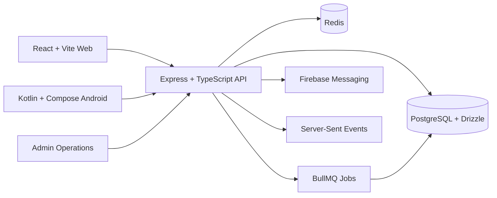

# DoorStep TN — Final-Year Project Readiness and Viva Brief

## Executive assessment

DoorStep TN is suitable for a final-year software engineering project when it
is presented as a bounded, role-aware local commerce and service-booking
platform—not as a finished commercial marketplace or a fully automated
payment/SMS product.

Its academic value comes from the integration of several non-trivial concerns:

- product discovery and shop catalogue management;
- service discovery, scheduling, availability, and booking state transitions;
- customer, provider, shop-owner, worker, and administrator workflows;
- server-side authentication, CSRF, authorization, ownership, validation, and
  rate limiting;
- location-aware discovery with explicit saved/device/manual/clear semantics;
- PostgreSQL persistence, migrations, Redis-backed sessions/cache/realtime, and
  BullMQ background jobs;
- a React web client and a native Kotlin/Jetpack Compose Android client;
- health, readiness, logging, monitoring, deployment, and test tooling.

The strongest one-sentence framing is:

> DoorStep TN is a role-aware local commerce and service-booking platform that
> unifies product discovery, provider scheduling, order/booking state
> transitions, and location-aware access for customers, shops, service
> providers, workers, and platform administrators.

## Problem statement

Small local businesses and independent providers commonly coordinate catalogues,
orders, appointments, payment references, and customer addresses through
separate messaging channels. This creates duplicated data, missed updates,
limited availability visibility, and weak operational traceability.

DoorStep TN addresses the problem by providing one API and two clients for:

1. finding nearby shops, products, and services;
2. maintaining shop catalogues and provider offerings;
3. placing product orders and service bookings;
4. tracking operational state changes;
5. controlling shop-worker responsibilities;
6. retaining a platform-level operational and audit view.

## Objectives and measurable outcomes

| Objective                        | Implementation evidence                                                                              |
| -------------------------------- | ---------------------------------------------------------------------------------------------------- |
| Unify commerce and service flows | Product, cart, order, service, booking, review, and notification modules                             |
| Support multiple actors          | Customer/provider/shop/worker/admin sessions and role-aware pages/routes                             |
| Protect cross-user data          | Server-side role, ownership, worker-context, CSRF, validation, and suspension checks                 |
| Improve local discovery          | Latitude/longitude/radius query support with saved, device, manual, and clear states                 |
| Provide reusable clients         | React/Vite web app plus Retrofit/OkHttp Android app using the same API                               |
| Operate the system               | Health/readiness endpoints, structured logs, Redis/BullMQ jobs, migrations, and deployment templates |
| Evaluate correctness             | Automated tests, TypeScript checking, linting, production build, and documented manual flows         |

## Users and responsibilities

### Customer

The customer browses products/services/shops, selects an optional nearby
location, manages a cart or wishlist, places orders, books services, follows
state transitions, and reviews completed work.

### Service provider

The provider maintains only their own service listings, availability, working
hours, blocked time, bookings, profile, and earnings. A provider cannot update
another provider's service by changing an ID in the request.

### Shop owner

The shop owner manages the shop profile, products, inventory, orders,
promotions, reviews, and worker assignments. Product ownership is derived from
the authenticated shop context rather than trusted from the request body.

### Shop worker

The worker authenticates with a worker number/PIN and receives only the
responsibilities assigned by the shop. The link is active/inactive. Revoking a
worker deactivates access while preserving historical references.

### Administrator

The administrator uses `/admin/login` and platform routes for health,
monitoring, accounts, roles, orders, bookings, disputes, and moderation. Admin
credentials come from deployment secrets and are separate from demo local
accounts.

## Architecture



### Request lifecycle

```text
client request
  -> CORS/security headers/body parsing
  -> session authentication
  -> CSRF for state-changing methods
  -> role/profile/worker permission
  -> ownership/verification/business precondition
  -> Zod validation and normalization
  -> storage/database mutation
  -> cache/realtime/job invalidation
  -> structured response and metrics
```

This ordering is important. A UI may hide an unavailable button, but the API
still repeats the decision so a modified client cannot bypass it.

## Key workflows to demonstrate

### Customer product flow

1. Sign in as the demo customer or create a local account.
2. Browse without a location to show the general catalogue.
3. Select saved/device/manual location and show nearby filtering.
4. Click Clear and show that the active geo parameters disappear without
   deleting the saved profile location.
5. Add a product to the cart and place an order.
6. Demonstrate payment-reference/manual-confirmation state transitions.

### Customer service flow

1. Browse services by category and optional location.
2. Open a service and choose a valid slot.
3. Create a booking as a customer.
4. Use provider/admin actions to show acceptance, progress, completion, and
   review eligibility.

### Provider flow

1. Sign in/select provider profile.
2. Complete required profile/verification information.
3. Create a service with valid description, price, duration, and schedule.
4. Update availability or block time.
5. Accept and complete a booking, then show provider history/earnings.

### Shop and worker flow

1. Sign in/select the shop profile and complete shop verification.
2. Create/update inventory and products.
3. Add a worker with explicit responsibilities.
4. Sign in as the worker and demonstrate an allowed shop operation.
5. Demonstrate a denied operation when the responsibility is missing.
6. Revoke the worker and show that history remains while access ends.

### Admin and operations flow

1. Open `/admin/login` with configured admin credentials.
2. Show dashboard, health, readiness, monitoring, accounts, and audit views.
3. Explain why admin access is separate from customer/provider/shop login.

## Important correctness fixes and their rationale

### Location profile clear

The API accepts a complete coordinate pair or two nulls. Empty strings from the
mobile client are normalized to null. A half-cleared pair is rejected because
distance queries cannot safely use one coordinate.

### Browse filter clear

Saved profile location and active browse location are separate state. The shared
web hook now synchronizes profile coordinates only when the profile value
changes. If it watched the active location too, Clear would immediately restore
the saved coordinates. Clearing now removes the source, coordinates, and geo
query parameters while leaving “Saved location” available for explicit reuse.

### Product/service writes

Strict allow-listed schemas accept editable listing fields and reject IDs,
ownership, deletion flags, timestamps, and other server-controlled values.
This prevents a client from moving a product to another shop or changing a
service owner. Deleted records are not returned as ordinary public details and
cannot be booked or updated.

### Worker updates and revocation

Worker contacts are normalized and duplicate-checked excluding the current
worker. User and shop-link changes are transactional. Revocation sets the
worker link inactive rather than hard-deleting a user referenced by history.

### Dynamic local network

`npm run dev:all` detects the current non-loopback LAN IPv4 address, binds the
development servers for LAN access, configures the Vite proxy, and prints web,
API, admin, and Android addresses. A physical-device APK still embeds its URL
at build time, so changing networks requires a debug rebuild/reinstall.

## Verification evidence

Latest repository verification performed for this documentation update:

- `npm test`: 684 tests passed across 240 suites.
- `npm run check`: passed.
- `npm run lint`: passed.
- `npm run build`: passed; Vite produced the client bundle and esbuild produced
  the server bundle.
- `git diff --check`: passed for the documentation/code worktree.

The production build reports a non-blocking Browserslist data-age warning. The
repository targets Node.js 20.x. The current workstation used Node.js 26.7.0;
the normal test command passed, but `npm run test:coverage` could not be used
to refresh coverage in that environment because the installed coverage tool
failed with a Node 26 ESM/CommonJS `yargs` error. Run coverage under the
supported Node.js 20.x toolchain before quoting a new percentage in a report.

The Android Gradle build was not claimed as passed in this environment because
JDK 17/Android SDK availability must be verified separately. The Android guide
documents the exact required toolchain and local-network build inputs.

## What the project can and cannot claim

### Supported claims

- This is a multi-role full-stack system with two clients and one shared API.
- The API validates writes and enforces server-side authorization.
- Location-aware discovery and explicit filter clearing are implemented.
- Product, service, worker, order, booking, notification, migration, and
  monitoring workflows are represented in code.
- Automated tests and build checks provide repeatable correctness evidence.

### Claims that would be inaccurate

- “Any logged-in user can perform every action.” Authentication and
  authorization are different.
- “The system has no restrictions.” CSRF, ownership, role, suspension,
  verification, and worker permissions are necessary safeguards.
- “SMS OTP is production-delivered.” Local OTP is a private/demo mechanism
  unless a real SMS provider is configured.
- “Payments are automatically settled.” The current payment-reference flow is
  manual/operator-confirmed rather than a live gateway settlement.
- “Push notifications always work.” Firebase project, client config, server
  credentials, permissions, and network reachability are required.
- “The Android app has an independent backend.” It consumes the same API.
- “Unit/contract tests prove full production readiness.” Browser, device,
  deployment, TLS, backup, external-service, and authenticated end-to-end tests
  remain environment-specific.

## Limitations and future work

1. Connect a production SMS provider and document abuse/verification controls.
2. Integrate a payment gateway with webhook signature verification and
   idempotent settlement records.
3. Expand browser-to-database and Android hardware end-to-end coverage.
4. Run coverage under the supported Node.js version and publish the generated
   artifact with the submission.
5. Add production backup/restore drills, observability dashboards, and a
   formal incident response runbook.
6. Review legacy migration files and consolidate historical references when
   the database migration policy allows it.
7. Add privacy retention/export controls and a formal threat model for location
   data and worker/customer personal information.

These are credible future-work items, not reasons to claim the current system
does not qualify as a final-year project.

## Likely viva questions and concise answers

### Why use a shared API for web and Android?

It centralizes business rules, ownership, validation, and state transitions so
the two clients cannot silently implement different commerce behaviour.

### Why is CSRF needed with session cookies?

Browsers attach cookies automatically. CSRF tokens prove that a state-changing
request came through an authorized client session rather than an unrelated
cross-site request.

### Why are IDs and owner IDs rejected in product/service writes?

They are identity/lifecycle fields, not editable listing data. Trusting them
would allow cross-owner mutation or inconsistent historical data.

### Why can login succeed while an action returns 403?

Login authenticates identity. The later operation additionally checks role,
profile/verification, worker responsibility, suspension, ownership, and CSRF.

### Why does Clear not delete the saved profile location?

Search preference and persistent profile data have different purposes. Users
often want a general browse view temporarily and still want their address
available for explicit reuse.

### Why revoke workers instead of deleting them?

Historical orders, audit records, and relationships may reference the worker.
Deactivation stops access without destroying referential history.

### How would the system scale?

Run multiple API instances behind a reverse proxy, use shared PostgreSQL and
Redis, keep session/realtime state shared, and ensure BullMQ jobs use distributed
locks. Then add database indexes, cache policy, metrics, and load testing based
on measured bottlenecks.

### What is the most important security lesson?

Client-side UI is not a security boundary. Every sensitive operation must repeat
authentication, authorization, validation, and ownership checks on the server.

## Recommended presentation order

1. State the problem and actors.
2. Show architecture and the shared API boundary.
3. Demonstrate one customer product flow and one service booking flow.
4. Demonstrate provider/shop/worker role differences.
5. Demonstrate location selection and the corrected Clear behaviour.
6. Show admin health/monitoring and one intentionally rejected request.
7. Explain the mutation schemas, worker revocation, and migration approach.
8. Present test/build evidence and limitations honestly.
9. Close with future work tied to real deployment requirements.

## Final recommendation

Proceed with DoorStep TN as a final-year project. The implementation is broad
enough to demonstrate software architecture, database design, API contracts,
security, client integration, and operational thinking. The submission becomes
stronger when it includes a reproducible setup, a clean demo dataset, test/build
evidence, an Android build under the supported toolchain, and explicit limits
around SMS, payments, push, coverage, and production deployment.
