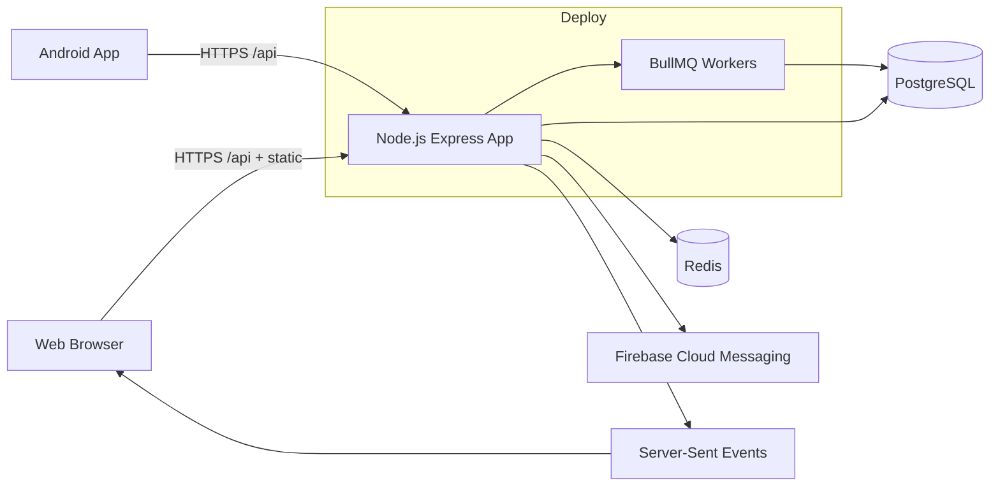
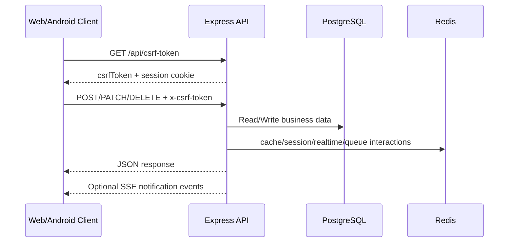
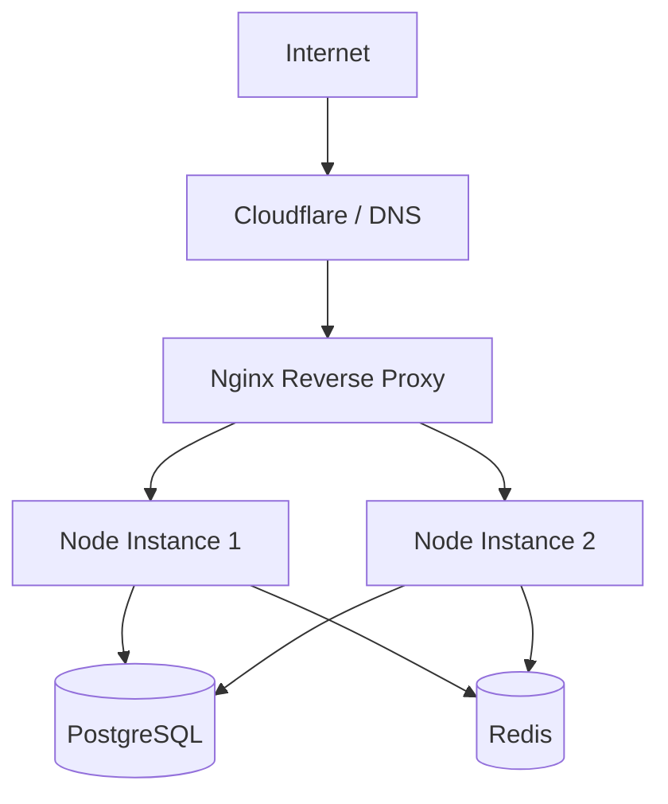

# DoorStep TN Platform Guide

This repository hosts the DoorStep TN platform backend and web app, plus deployment and Android app assets.

This file is the primary operational source of truth for:

- local setup
- environment and account requirements
- Android setup
- deployment (systemd, PM2, Kubernetes)
- operations and troubleshooting

It is intentionally written for three audiences:

1. A student or evaluator who wants to understand the complete project.
2. A developer who needs to run, test, or extend it safely.
3. An operator who needs to diagnose a local, LAN, Android, or production
   deployment without guessing which URL, role, database, or session is in use.

## Documentation Set

- `README.md` (this file): setup, deployment, environment, and runbook.
- `SOFTWARE_MANUAL.md`: detailed API manual plus backend/frontend/android code map.
- `doorstep-android/README.md`: Android build, signing, release, and store checklist.
- `PROJECT_REPORT.md`: final-year framing, evidence, limitations, and viva plan.

Documentation rule: code, migrations, and `.env_example` are authoritative for
behaviour and configuration. Markdown explains the intended workflow and the
reason for each boundary; it must not be used to bypass server authorization,
CSRF, validation, ownership, or production-secret requirements.

## 1. What This Repository Contains

DoorStep TN is a multi-role local commerce platform for:

- product marketplace (shops to customers)
- service booking (providers to customers)
- admin platform operations

Main runtime stack:

- Backend API: Express + TypeScript
- Frontend: React + Vite
- Database: PostgreSQL + Drizzle
- Cache/queues/realtime fanout: Redis + BullMQ + SSE
- Mobile app (native): Kotlin + Jetpack Compose (`doorstep-android/`)

## 2. Architecture

### 2.1 High-Level System Diagram



### 2.2 Runtime Flow Diagram



## 3. Repository Map

```text
client/                 React frontend
server/                 Express API, routes, jobs, services
shared/                 Shared schema/types
migrations/             SQL migrations + drizzle meta
config/                 Network config templates
deploy/                 Nginx, systemd, Kubernetes samples
scripts/                Utility scripts (migrate, checks, tunnel)
doorstep-android/       Native Android app (Kotlin)
```

Note:

- `android/` at repo root is generated local build output and should not be committed.
- `dist/` is generated by `npm run build`.

## 4. Accounts and Services You Need

### 4.1 Mandatory for Development

1. GitHub/Git access to this repository.
2. PostgreSQL instance (local or cloud).
3. Node.js 20.x and npm.

### 4.2 Needed for Full Feature Set

1. Redis (required for production; optional in local API-only testing).
2. Firebase project:

- Phone Auth for OTP flows in client
- FCM for push notifications
- service account JSON for server-side OTP token verification

### 4.3 Needed for Production Deployment

1. VPS or container/Kubernetes environment.
2. Domain + DNS management.
3. TLS certificate setup (for HTTPS).
4. Optional Cloudflare account (if using Cloudflare proxy/tunnel/pages).

### 4.4 Needed for Android Release

1. Google Play Console account.
2. Android keystore (upload/app signing key).
3. Firebase Android app (`google-services.json`).

## 5. Local Machine Prerequisites

Install:

```bash
node -v    # should be v20.x
npm -v
psql --version
redis-server --version   # optional for local if DISABLE_REDIS=true
```

If Redis is not installed locally, set `DISABLE_REDIS=true` in `.env` for development.

## 6. First-Time Local Setup

### 6.1 Clone and install

```bash
git clone <your-repo-url>
cd doorstep-api
npm install
```

### 6.2 Create `.env`

```bash
cp .env_example .env
```

`.env_example` is the checked-in template. `.env` is machine-specific and is
ignored by Git; never paste a real `.env` into an issue, commit, screenshot, or
demo recording. The application reads `.env` at runtime, while Vite also reads
it during frontend configuration. Restart the relevant process after changing
values.

Set at least:

```env
NODE_ENV=development
PORT=5000
DATABASE_URL=postgresql://<user>:<password>@localhost:5432/<db>
SESSION_SECRET=<strong-random-secret>
ADMIN_EMAIL=<real-admin-email>
ADMIN_PASSWORD=<strong-admin-password>
VITE_API_URL=http://localhost:5000
```

If Redis is not available locally:

```env
DISABLE_REDIS=true
SESSION_STORE=postgres
```

### 6.3 Create PostgreSQL database

Example:

```bash
createdb doorstep_dev
```

Then set:

```env
DATABASE_URL=postgresql://localhost:5432/doorstep_dev
```

### 6.4 Run migrations

```bash
npm run db:migrate
```

If attaching to an existing database where schema already exists but migration history table is empty, run:

```bash
npm run db:migrate:baseline
```

### 6.5 One-command local setup

On another machine with the same `.env`, run this from the repository root:

```bash
bash scripts/setup-local.sh
```

The script skips tools and npm dependencies that are already installed, supports installed PostgreSQL 18 (and other PostgreSQL versions), starts local services when needed, creates the role/database named by `DATABASE_URL` when they are missing, and runs the migrations. It never sources `.env`, so cron expressions and other dotenv values are handled safely. If the URL role cannot be created through the local administrator account, add an uncommitted `DATABASE_ADMIN_URL` pointing to the `postgres` maintenance database. If Redis is intentionally unavailable, keep `DISABLE_REDIS=true` in `.env`.

The normal setup never deletes a database. For a disposable local database whose schema is genuinely corrupted, explicitly reset only the database named by `DATABASE_URL` and rebuild it:

```bash
bash scripts/setup-local.sh --reset-db
```

`--reset-db` refuses remote database hosts and refuses to reset the `postgres` maintenance database. Back up any local data you need first.

If PostgreSQL reports `permission denied` while creating the local role/database, the account in `DATABASE_URL` is not an administrator. On Linux, verify the local administrator connection with:

```bash
sudo -u postgres psql -d postgres
```

On macOS Homebrew PostgreSQL, connect as the account that owns the PostgreSQL cluster:

```bash
psql -d postgres
```

Then either grant the local setup role the required `CREATEDB` and `CREATEROLE` privileges, or set an uncommitted `DATABASE_ADMIN_URL` in `.env` to an administrator connection. The setup script does not require the application role to be a superuser once the database already exists.

After setup, start both processes with:

```bash
npm run dev:all
```

### 6.6 Start the app

Use two terminals for full local development:

Terminal 1 (API):

```bash
npm run dev:server
```

Terminal 2 (frontend):

```bash
npm run dev:client
```

Open:

- Frontend: `http://localhost:5173`
- API health: `http://localhost:5000/api/health`
- Swagger UI: `http://localhost:5000/api/docs`

Or start both processes with one command using the existing `.env` file:

```bash
npm run dev:all
```

`dev:all` detects the active non-loopback IPv4 address each time it starts and
prints the LAN frontend, API health, and admin login URLs. This makes the web
app reachable from another device on the same network. It also sets the Vite
proxy target to the local API, so a browser can keep using same-origin `/api`
requests instead of depending on a stale hard-coded IP.

Use `DEV_ALL_HOST=192.168.1.10 npm run dev:all` when the machine has multiple
network interfaces, a VPN, Docker, or a different preferred route. The
`DEV_ALL_HOST` override is a development convenience; it does not change the
production domain or grant access to the API. The script binds the development
servers to all interfaces, but only devices that can reach the host and pass
the configured browser/network checks can connect.

The printed admin entry point is always `/admin/login`; it still requires the
configured admin credentials and server permissions. For a physical Android
device, use the printed API address as
`-PLOCAL_API_BASE_URL=http://<current-lan-ip>:<api-port>` when building the
debug app. An Android emulator should use `http://10.0.2.2:<api-port>` because
that special address means “the host computer” inside the emulator.

The API port comes from `PORT` and the frontend port comes from
`DEV_SERVER_PORT`; neither is assumed to be fixed. If an old IP appears in the
browser or Android app, stop the old processes, run `npm run dev:all` again,
and rebuild/reinstall the debug APK with the new address.

Press `Ctrl+C` once to stop both the API and frontend.

Important behavior:

- `npm run dev` starts only the server.
- `npm run build && npm run start` serves built frontend from `dist/public` through Express.

## 7. Core Command Reference

```bash
npm run dev                # API dev server only
npm run dev:server         # API dev server
npm run dev:client         # Vite frontend dev server
npm run dev:all            # API + Vite frontend using the existing .env
npm run setup:local        # Install local prerequisites, prepare DB/Redis, and migrate
npm run setup:local -- --reset-db  # Explicitly rebuild the configured local dev database
npm run build              # Build frontend + backend bundle
npm run start              # Start production server from dist/
npm run db:generate        # Generate drizzle migration files
npm run db:migrate         # Apply migrations
npm run db:migrate:baseline # Seed drizzle migration history for existing DB
npm run db:check            # Validate migration journal/files before deployment
npm run check              # TypeScript check
npm run lint               # ESLint
npm run format             # Prettier
npm run test               # Test suite
npm run test:coverage      # Tests with coverage
npm run monitor            # Live monitoring script
npm run load:regression    # Load regression script
npm run security:checklist # Security checks
npm audit --omit=dev --audit-level=high # Production dependency gate (also in CI)
```

## 8. Environment Variables (Detailed)

Start from `.env_example` and set values per environment.

### 8.1 Required in Production

```env
NODE_ENV=production
PORT=5000
DATABASE_URL=postgresql://...
SESSION_SECRET=<strong-random-secret>
ADMIN_EMAIL=<real-email>
ADMIN_PASSWORD=<strong-password>
FRONTEND_URL=https://<frontend-domain>
APP_BASE_URL=https://<api-domain>
ALLOWED_ORIGINS=https://<frontend-domain>,https://<api-domain>
REDIS_URL=redis://<host>:6379
```

### 8.2 Commonly Configured

Database and performance:

- `DATABASE_REPLICA_URL`
- `DB_POOL_SIZE`
- `DB_READ_POOL_SIZE`
- `DB_SLOW_THRESHOLD_MS`
- `USE_IN_MEMORY_DB` (mostly test/dev)

Sessions:

- `SESSION_STORE` (`postgres` or `redis`)
- `SESSION_TTL_SECONDS`
- `SESSION_REDIS_PREFIX`
- `SESSION_COOKIE_SAMESITE`
- `SESSION_COOKIE_SECURE`
- `SESSION_COOKIE_DOMAIN`
- `SESSION_TABLE_NAME`
- `SESSION_SCHEMA_NAME`
- `SESSION_AUTO_CREATE_TABLE`
- `SESSION_PRUNE_INTERVAL_SECONDS`

Redis, jobs, and realtime:

- `DISABLE_REDIS`
- `DISABLE_RATE_LIMITERS`
- `BULLMQ_QUEUE_NAME`
- `BOOKING_EXPIRATION_CRON`
- `PAYMENT_REMINDER_CRON`
- `LOW_STOCK_DIGEST_CRON`
- `CRON_TZ`
- `PAYMENT_REMINDER_DAYS`
- `PAYMENT_DISPUTE_DAYS`
- `JOB_LOCK_TTL_MS`
- `BOOKING_EXPIRATION_LOCK_TTL_MS`
- `PAYMENT_REMINDER_LOCK_TTL_MS`
- `LOW_STOCK_DIGEST_LOCK_TTL_MS`
- `JOB_LOCK_PREFIX`
- `DISABLE_JOB_LOCK`
- `JOB_LOCK_FAIL_OPEN`

Routing/network/cors:

- `HOST` or `SERVER_HOST`
- `STRICT_CORS`
- `NETWORK_CONFIG_PATH`
- `DEV_SERVER_BIND`
- `DEV_SERVER_HOST`
- `DEV_SERVER_PORT`
- `DEV_SERVER_HMR_HOST`
- `DEV_SERVER_HMR_PORT`
- `DEV_SERVER_HMR_PROTOCOL`
- `API_PROXY_TARGET`
- `CLIENT_DIST_DIR`
- `DISABLE_STATIC_FILES`

Security/HTTPS:

- `HTTPS_ENABLED`
- `HTTPS_KEY_PATH`
- `HTTPS_CERT_PATH`
- `HTTPS_PASSPHRASE`
- `HTTPS_CA_PATH`
- `API_LEGACY_SUNSET_DATE`

Logging/monitoring:

- `LOG_LEVEL`
- `LOG_FILE_PATH`
- `LOG_TO_STDOUT`
- `LIVE_MONITOR_URL`
- `READINESS_TIMEOUT_MS`
- `SHUTDOWN_TIMEOUT_MS`

Local authentication:

- `LOCAL_AUTH_ENABLED`
- `LOCAL_AUTH_CONFIG_PATH`
- `LOCAL_AUTH_OTP` (local development signup OTP only)

Frontend build/runtime:

- `VITE_API_URL`
- `VITE_API_SAME_ORIGIN` (defaults to `true`; set `false` only for a separately hosted API)
- `VITE_APP_BASE_URL`
- `VITE_FALLBACK_API_URL`
- `VITE_ENABLE_DEBUG_LOGS`
- `VITE_ENABLE_PERMISSION_DEBUG`

Additional variables that are useful in specific deployments:

- `SERVER_HOST`: fallback server bind host when `HOST` is not supplied.
- `GEO_QUERY_MODE`: selects the configured geographic query implementation;
  keep the production value aligned with the database capabilities.
- `PUSH_NOTIFICATIONS_ENABLED`: enables the server-side push dispatch path.
- `FIREBASE_SERVICE_ACCOUNT_PATH`: service-account file used by Firebase Admin;
  keep it outside source control.
- `ALLOW_MOCK_FIREBASE_TOKENS`: test-only Firebase token behaviour; never enable
  it for a public deployment.
- `ENABLE_FIREBASE_ADMIN_IN_TEST`: allows Firebase Admin setup in tests that
  explicitly need it.
- `ENABLE_DEV_AUTH`: legacy/dev authentication switch used by selected test or
  demo environments; do not treat it as production authentication.
- `USE_IN_MEMORY_SESSION_STORE`: test-only session storage switch.
- `JOB_LOCK_FAIL_OPEN`: controls job-lock failure behaviour; fail-closed is the
  safer production choice unless the operational trade-off is documented.
- `SECURITY_FAIL_ON_FAIL`: makes security-checklist failures fail the command,
  which is recommended in CI.

The complete template, including defaults and comments, is always
`.env_example`. A variable is not automatically safe merely because it exists
in the template: `DISABLE_REDIS`, `DISABLE_RATE_LIMITERS`, mock Firebase flags,
demo local authentication, and HTTP cleartext are development/test controls.
They must be reviewed before production deployment.

## 9. Authentication, Sessions, and CSRF

### Local authentication without Firebase

`config/local-auth.json` is included with three safe demo accounts so a fresh
clone can run immediately. Each uses PIN `2702` and has no password. Existing
accounts sign in with phone + PIN; OTP is used when creating a new account:

- Customer: `9876543210`
- Provider: `9876543211`
- Shop: `9876543212`

Edit that JSON file to add or change phone numbers, PINs, names, roles, or
languages, then restart the backend. For private credentials that must not be
committed, copy it to `config/local-auth.local.json` and set
`LOCAL_AUTH_CONFIG_PATH=config/local-auth.local.json`; that local override is
ignored by Git. The sign-in screen uses only phone + PIN and creates or
upgrades the matching app user on its first successful sign-in. New-account
registration uses the local OTP flow below; no password, Firebase, Google
sign-in, reCAPTCHA, or SMS provider is required. In production, set
`LOCAL_AUTH_ENABLED=true` only for a private demo deployment.

To create a new local account, open the **Create account** tab, enter a name
and phone number, click **Get OTP**, confirm the 4-digit PIN, and choose
Customer, Service provider, or Shop owner. Local development uses
`LOCAL_AUTH_OTP=123456` and fills that OTP automatically; no Firebase or SMS
provider is needed. Provider/shop profiles are created during registration and
can be completed after the first sign-in.

- API uses cookie sessions.
- For state-changing requests (`POST`, `PUT`, `PATCH`, `DELETE`), include `x-csrf-token`.
- Fetch token from `GET /api/csrf-token`.
- Frontend request helpers in `client/src/lib/queryClient.ts` already implement this flow.

Quick manual flow:

```bash
CSRF=$(curl -s -c cookies.txt -b cookies.txt http://localhost:5000/api/csrf-token | jq -r .csrfToken)

curl -s -c cookies.txt -b cookies.txt \
  -H "x-csrf-token: $CSRF" \
  -H "Content-Type: application/json" \
  -X POST http://localhost:5000/api/auth/login-pin \
  -d '{"phone":"9876543210","pin":"2702"}'

CSRF=$(curl -s -b cookies.txt -c cookies.txt http://localhost:5000/api/csrf-token | jq -r .csrfToken)

curl -s -b cookies.txt -c cookies.txt \
  -H "x-csrf-token: $CSRF" \
  -H "Content-Type: application/json" \
  -X POST http://localhost:5000/api/auth/check-user \
  -d '{"phone":"9876543210"}'
```

## 10. Location, filters, and reset behaviour

Location has two different meanings in the application and they must not be
confused:

1. **Saved profile location** is persistent data stored for a user or shop.
   It is used as an optional starting point for nearby discovery.
2. **Active browse location** is temporary UI/query state used by Shops,
   Services, and Products. It can come from the profile, the device GPS, or
   manually entered coordinates.

The location popover exposes four intentional actions:

- **Saved location** explicitly activates the profile coordinates.
- **Use device** requests browser/device permission and activates the current
  device coordinates without overwriting the saved profile.
- **Enter coordinates** activates validated latitude/longitude entered by the
  user.
- **Clear** removes the active location from the current browse filter. It does
  not delete the saved profile location. The saved location remains available
  until the user chooses it again.

The shared implementation is `client/src/hooks/use-location-filter.ts`. Each
browse page has its own radius storage key, but all three pages use the same
state contract. A cleared filter produces an ordinary unlocated list request:
the page removes `lat`, `lng`, and `radius` from its query and resets pagination
so the old nearby result set cannot remain selected.

The important implementation rule is that profile coordinates are synchronized
only when the profile coordinates themselves change. If the effect also watched
the active `location`, clicking Clear would update state, rerun the effect, and
immediately restore the old profile coordinates. This was the cause of the
“Clear goes back to the old location” bug.

If a location still appears after clearing:

1. Confirm the popover says no selected point/source.
2. Check the browser Network panel: the next `/api/shops`, `/api/services`, or
   `/api/products` request must not contain `lat`, `lng`, or `radius`.
3. Hard-refresh once if an old production bundle is cached.
4. If the profile itself was intended to be cleared, use the profile location
   form's **Clear location** action and save it. That sends both coordinates as
   `null`; sending only one coordinate is rejected because a half-location is
   unsafe for distance calculations.

## 11. Roles, authorization, and why a 403 can be correct

The application deliberately keeps authorization on the server. Hiding a
button in React is not a security boundary, and removing the server checks
would let a modified browser or script alter another user's data. The normal
request path is:

```text
session -> CSRF (for writes) -> role/profile -> ownership/worker permission
       -> validation -> database mutation -> cache/realtime invalidation
```

The main roles are:

| Role       | Normal capabilities                                                                                            |
| ---------- | -------------------------------------------------------------------------------------------------------------- |
| Customer   | Browse, manage cart/wishlist, place orders, book services, review completed work, manage own profile/location. |
| Provider   | Own service listings, availability, blocked time, provider bookings, provider profile, and earnings.           |
| Shop owner | Own shop profile, products, inventory, orders, promotions, reviews, and workers.                               |
| Worker     | Shop operations allowed by the worker's explicit responsibilities and active shop link.                        |
| Admin      | Platform administration, health/monitoring, user/account operations, disputes, and platform-level workflows.   |

The product/service/worker fixes do not remove these boundaries. They make the
valid flows reliable by resolving the correct shop context, accepting only
editable fields, refreshing newly-created profiles, checking ownership, and
returning a useful status code. A 403 should therefore be diagnosed by asking
which check failed:

- missing/invalid CSRF token: request is a browser write without the current
  session token;
- suspended account: the account is intentionally blocked;
- missing shop/provider profile or verification: complete the required profile
  workflow;
- wrong role: use the role-specific account or switch to the correct profile;
- missing worker responsibility/inactive link: the shop owner must update the
  worker assignment;
- ownership mismatch: the resource belongs to another shop/provider;
- production CORS/origin mismatch: configure the real frontend origin.

Do not “fix” a 403 by making the endpoint public or by disabling CSRF. Use the
response body, server log request ID, current session, role, ownership, and
permission assignment to fix the actual mismatch.

## 12. Product, service, and worker mutation contracts

### Product lifecycle

Shop owners and workers with `products:write` can create, update, and delete
products in their resolved shop context. Product writes accept listing fields
such as name, description, price, MRP, stock, category, images, availability,
SKU/barcode, dimensions, specifications, tags, order quantities, and low-stock
threshold. The server always controls the product ID, shop ownership,
deletion state, and timestamps. A client cannot move a product to another shop
by posting a different `shopId`.

Delete is treated as an operation with historical consequences: cart references
are removed safely, the product is marked/deleted through the storage layer, and
direct/detail/shop-list caches are invalidated. Existing order history must not
be silently rewritten.

### Service lifecycle

Providers can create and update only their own services. Writable fields include
description, price, duration, availability, category, images, address,
working/break hours, buffers, booking limits, service location type, and
availability notes/slots. `providerId`, service ID, deletion state, and server
timestamps are assigned or checked by the API. Deleted services are not
bookable, editable, or returned as normal public detail records.

Provider-wide availability updates all of that provider's services and
invalidates both detail and provider-list caches. Deleting a service with
historical bookings may be refused; marking it unavailable is the safe fallback
when history must remain intact.

### Worker lifecycle

Worker numbers are exactly ten digits. Creation validates the name, PIN,
contact fields, responsibilities, and uniqueness of worker number/email/phone.
Updates normalize contacts, reject duplicates excluding the worker being edited,
validate PINs and responsibilities, and apply user/link changes transactionally.
Deleting a worker revokes the shop link (`active=false`) instead of deleting the
user row, preserving order/audit/history references. A revoked worker cannot
authenticate into shop operations.

These contracts explain why a client should send only editable fields. Extra
identity or ownership fields are rejected rather than ignored, making bugs
visible early and preventing accidental cross-owner mutations.

## 13. Common end-to-end flows

### Customer

1. Get a CSRF token and session cookie.
2. Sign in with local phone/PIN or the configured production auth flow.
3. Select the customer profile.
4. Browse without a location, or explicitly select saved/device/manual
   location.
5. Add products to a cart and create an order, or choose a service and create
   a booking.
6. Follow the order/booking state transitions and payment-reference workflow.
7. Review only after the relevant completion condition.

### Provider

1. Sign in and select the provider profile.
2. Complete the provider profile/verification requirements.
3. Create a service with a non-empty description and valid price/duration.
4. Configure availability, working hours, blocked time, and provider-wide
   availability when required.
5. Accept/complete bookings using the provider state transitions.
6. Review earnings and respond to reviews.

### Shop owner and worker

1. Sign in and select the shop profile.
2. Complete the shop profile and any verification requirement.
3. Create products, update inventory, and manage orders.
4. Add a worker with explicit responsibilities; the worker signs in using the
   worker number/PIN.
5. Confirm that the worker's responsibility covers the requested operation.
6. Revoke access by deactivating the worker link when access should end.

### Administrator

1. Open `/admin/login`, not the normal customer/provider/shop login.
2. Use `ADMIN_EMAIL` and `ADMIN_PASSWORD` seeded at server startup.
3. Change the initial password and use the admin dashboard/health/monitoring
   tools.
4. Treat admin credentials as deployment secrets; the demo local accounts do
   not grant admin access.

## 14. Android Setup (Summary)

Native Android app is under `doorstep-android/`.

Use this sequence:

```bash
cd doorstep-android
./gradlew test
./gradlew assembleDebug
```

Detailed Android instructions, release signing, Firebase setup, and Play Store packaging are in:

- [`doorstep-android/README.md`](doorstep-android/README.md)

## 15. Deployment Guide (Detailed)

### 15.1 Deployment Topology Diagram



### 15.2 Option A: Single VPS with systemd (recommended baseline)

### Step 1: Provision server dependencies

```bash
sudo apt update
sudo apt install -y git curl build-essential nginx
curl -fsSL https://deb.nodesource.com/setup_20.x | sudo -E bash -
sudo apt install -y nodejs
```

Install PostgreSQL and Redis (or use managed services).

### Step 2: Create app directory and user

```bash
sudo useradd -r -s /bin/false doorstep || true
sudo mkdir -p /opt/doorstep
sudo chown -R $USER:$USER /opt/doorstep
cd /opt/doorstep
```

### Step 3: Deploy code

```bash
git clone <your-repo-url> .
npm install
cp .env_example .env
```

Edit `.env` for production values.

### Step 4: Build and migrate

```bash
npm run build
npm run db:migrate
```

### Step 5: Install systemd unit

Use provided file:

- `deploy/systemd/doorstep-api.service`

Install:

```bash
sudo cp deploy/systemd/doorstep-api.service /etc/systemd/system/doorstep-api.service
sudo sed -i 's|/opt/doorstep|/opt/doorstep|g' /etc/systemd/system/doorstep-api.service
sudo systemctl daemon-reload
sudo systemctl enable doorstep-api
sudo systemctl start doorstep-api
sudo systemctl status doorstep-api
```

### Step 6: Configure Nginx reverse proxy

Use provided template:

- `deploy/nginx-load-balancer.conf`

Install:

```bash
sudo cp deploy/nginx-load-balancer.conf /etc/nginx/conf.d/doorstep-api.conf
sudo nginx -t
sudo systemctl reload nginx
```

### Step 7: HTTPS

Use your preferred TLS method (Certbot or Cloudflare origin cert). Ensure:

- API is reachable via `https://<api-domain>`
- `APP_BASE_URL` and `ALLOWED_ORIGINS` use HTTPS URLs

### 15.3 Option B: PM2 runtime

Use included ecosystem file:

- `ecosystem.config.js`

Commands:

```bash
npm run build
npx pm2 start ecosystem.config.js
npx pm2 save
npx pm2 startup
```

If you use cluster mode with PM2, keep Redis enabled for shared session/realtime behavior.

### 15.4 Option C: Kubernetes

Use provided manifest:

- `deploy/k8s/doorstep-api.yaml`

Apply:

```bash
kubectl apply -f deploy/k8s/doorstep-api.yaml
```

Then configure:

- image reference (`your-registry/doorstep-api:latest`)
- environment variables via ConfigMap/Secret
- Ingress, TLS, autoscaling, and persistent dependencies (DB/Redis)

### 15.5 Option D: Cloudflare tunnel (quick external exposure)

Script available:

- `scripts/start_cloudflare_tunnel.sh`

Usage:

```bash
chmod +x scripts/start_cloudflare_tunnel.sh
./scripts/start_cloudflare_tunnel.sh
```

This builds the app, starts API, then runs `cloudflared tunnel --url http://localhost:5000`.

## 16. Production Readiness Checklist

Before go-live, verify all:

1. `NODE_ENV=production`
2. strong `SESSION_SECRET`
3. strong `ADMIN_EMAIL` and `ADMIN_PASSWORD`
4. explicit `ALLOWED_ORIGINS` (no wildcard in production)
5. `REDIS_URL` configured and reachable
6. DB migrations applied
7. health checks return OK:

- `/api/health`
- `/api/health/ready`

8. HTTPS enabled at edge/proxy
9. logs are collected and rotated
10. backups for PostgreSQL are configured

## 17. Operations and Troubleshooting

### 13.1 Health and readiness

- `GET /api/health` for liveness/basic runtime
- `GET /api/health/ready` validates dependencies (DB, Redis, BullMQ readiness)

### 13.2 Common failures

1. `DATABASE_URL environment variable is required`

- Fix `.env` and restart.

2. Static frontend not served

- Run `npm run build`.
- Ensure `dist/public/index.html` exists.

3. CORS blocked in production

- Set `ALLOWED_ORIGINS` correctly.
- Confirm `FRONTEND_URL` and `APP_BASE_URL` match real domains.

4. PIN login fails

- Confirm `LOCAL_AUTH_ENABLED=true` for development.
- Confirm `config/local-auth.json` contains the phone number and exactly four digits.
- Restart the server after changing either the config or `.env`.

5. Admin bootstrap fails at startup

- Set secure non-default `ADMIN_EMAIL` and `ADMIN_PASSWORD`.

### 13.3 Logs

Default log file path:

- `logs/app.log`

Key toggles:

- `LOG_LEVEL`
- `LOG_TO_STDOUT`
- `LOG_FILE_PATH`

## 18. Security Notes

1. Never commit `.env`, private local-auth overrides, service account JSON, or keystores. The tracked `config/local-auth.json` contains demo-only credentials by design; replace it or use the ignored `config/local-auth.local.json` for any real account.
2. Keep secrets in secret manager/CI variables for production.
3. Use strong admin credentials and rotate periodically.
4. Use HTTPS only for production traffic.
5. Keep dependencies patched and run `npm audit` in CI.

## 19. API Discovery

- Swagger UI: `/api/docs`
- Versioned API prefix compatibility: `/api/v1/*`
- Legacy prefix `/api/*` still supported with deprecation headers

## 20. Troubleshooting decision tree and FAQ

### “The page says 403 Forbidden”

First identify whether it is a browser/API security failure or a business
authorization failure. Inspect the response JSON and server log; the status
alone is not enough. For a write request, obtain a fresh CSRF token using the
same cookie jar, send the token in `x-csrf-token`, and make sure the browser is
not mixing `localhost`, `127.0.0.1`, and a LAN hostname across requests. Then
check the logged-in role, profile, suspension state, verification state, and
resource ownership. For a worker, check the active shop link and exact
responsibility.

### “Saving my profile returns 400 Invalid input”

The endpoint validates the complete location pair and the profile schema. A
clear operation must send both `latitude` and `longitude` as `null` (the mobile
client may send empty strings, which the API normalizes to null). A latitude
without a longitude, a longitude without a latitude, non-numeric values, or
coordinates outside valid Earth ranges are rejected. Also check that the
frontend is not sending display-only fields or an old schema after a cached
bundle; refresh and inspect the request body.

### “Clear does not clear Shops/Services/Products”

The active filter and saved profile location are separate. Click **Clear** in
the browse popover to remove only the active query. If the old location returns
immediately, make sure the browser loaded the new bundle and confirm the next
request has no geo parameters. If the saved profile itself should be deleted,
clear and save it in the profile location section.

### “The Android app still uses an old local IP”

`npm run dev:all` detects the current LAN address at startup, but an APK embeds
its base URL at build time. Restart the dev processes, read the newly printed
API URL, rebuild with `-PLOCAL_API_BASE_URL=...`, and reinstall the APK. The
emulator uses `10.0.2.2`; a physical phone uses the computer's reachable LAN
address; Genymotion uses `10.0.3.2`. Confirm the phone and computer share a
network and that the firewall permits the API port.

### “Product/service update returns 400”

Send only fields from the documented mutation contract. IDs, owner IDs,
deletion flags, search fields, and timestamps are server-controlled and are
intentionally rejected. For services, confirm the authenticated provider owns
the service and the service is not deleted. For products, confirm the shop or
worker has `products:write` and the shop profile is verified.

### “A worker can log in but cannot manage something”

Authentication proves who the worker is; it does not grant every shop action.
The shop owner must assign the required responsibility and keep the worker link
active. The worker context is resolved from the shop link, so a worker cannot
select an arbitrary shop ID in the request body.

### “The server starts but the browser cannot connect”

Check `/api/health` directly, then check the frontend proxy target. With
`npm run dev:all`, use the printed URLs and do not manually retain yesterday's
LAN IP. With separate commands, set `PORT`, `DEV_SERVER_PORT`, and
`API_PROXY_TARGET` consistently. In a production reverse proxy, verify the
upstream port, `FRONTEND_URL`, `APP_BASE_URL`, `ALLOWED_ORIGINS`, cookies, and
TLS termination.

### “Readiness fails”

`/api/health` is a liveness check; `/api/health/ready` checks required
dependencies. Confirm PostgreSQL, Redis (unless intentionally disabled for a
local test), migration state, credentials, and firewall/DNS. Do not declare a
deployment healthy just because the process is listening.

### “Migrations look inconsistent”

Run `npm run db:check` before deployment. It validates journal order, duplicate
tags, SQL files, and snapshots, and reports legacy SQL files that are retained
as history but are not automatically applied. For an existing database whose
schema is already present but whose Drizzle history is empty, use
`npm run db:migrate:baseline` only after confirming the expected tables exist.
Never use a baseline command to hide a missing schema.

### “Which checks should I run before handing this project to someone?”

Run the following from the repository root:

```bash
npm run db:check
npm run check
npm run lint
npm test
npm run build
```

For a release candidate also configure real services, run `npm audit
--omit=dev --audit-level=high`, execute the Android test/debug build with JDK
17 and Android SDK 35, verify migrations against a disposable database, and
test the primary flows on a physical device. A local test run with in-memory
data is evidence of code behaviour, not evidence that production credentials,
TLS, push delivery, backups, or payment settlement are configured.

### “Why are some safeguards still present when the goal is a smooth flow?”

The system removes accidental friction—stale profile rehydration, incorrect
shop context, unsafe mutation payloads, duplicate worker contacts, and broken
cache invalidation—but keeps safeguards that protect users and data. Smooth
UX means valid users can complete valid actions reliably; it does not mean any
role can mutate any record or that a client can bypass CSRF and ownership.

---

For deep internals and module-by-module documentation, see [`SOFTWARE_MANUAL.md`](SOFTWARE_MANUAL.md).

For native Android details, see [`doorstep-android/README.md`](doorstep-android/README.md).
