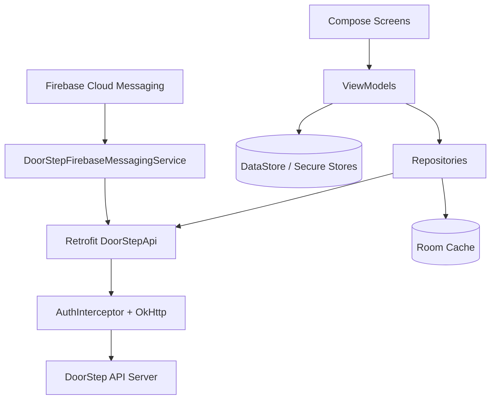

# DoorStep TN Native Android App Guide

This folder contains the native Android application for DoorStep TN. It is a
client of the repository's Express API; it does not have a separate backend or
database. The web app and Android app therefore share authentication semantics,
roles, CSRF protection, profile data, products, services, workers, bookings,
orders, and notifications.

For cross-project architecture/API/backend/frontend mapping, also read `../SOFTWARE_MANUAL.md`.

Tech stack:

- Kotlin
- Jetpack Compose (Material 3)
- Hilt DI
- Retrofit + OkHttp + Moshi
- Room + DataStore
- Firebase Auth + Firebase Messaging

Read the root `README.md` first for PostgreSQL, Redis, local authentication,
LAN discovery, admin access, and production deployment. Read
`../SOFTWARE_MANUAL.md` for the API/role contract and module map.

## 1. Architecture



## 2. Project Configuration

From `app/build.gradle.kts`:

- `applicationId`: `com.doorstep.tn`
- `compileSdk`: 35
- `minSdk`: 26
- `targetSdk`: 35
- Java/Kotlin target: 17

Release builds enforce validation for:

- `VERSION_CODE`
- `API_CERT_PINS`
- `RELEASE_KEYSTORE_FILE`
- `RELEASE_KEYSTORE_PASSWORD`
- `RELEASE_KEY_ALIAS`
- `RELEASE_KEY_PASSWORD`

If missing, release build fails by design.

## 3. Required Accounts and External Setup

### 3.1 Required for a complete Firebase-enabled build

1. Firebase project

- Android app registration in Firebase console
- download `google-services.json`

2. DoorStep backend API environment

- reachable HTTPS API domain (default in code: `https://doorsteptn.in`)

For a local authentication demonstration, the backend can use the repository's
local phone/PIN configuration (`LOCAL_AUTH_ENABLED=true`) and the Android app
can exercise the same API without a real SMS provider. Firebase is still needed
for production phone-auth/push behaviour and should be configured before
claiming those features work end to end.

### 3.2 For Production Release

1. Google Play Console account
2. Upload/signing keystore
3. SSL pin values (`API_CERT_PINS`) if certificate pinning is enabled

## 4. Local Prerequisites

Install:

- Android Studio (latest stable)
- Android SDK Platform 35
- JDK 17

Check tooling:

```bash
cd doorstep-android
./gradlew --version
```

The expected toolchain is JDK 17 and Android SDK Platform 35. If Gradle says
“Unable to locate a Java Runtime”, install/select JDK 17 in Android Studio or
set `JAVA_HOME` for the shell before running Gradle. A backend-only web test
run cannot be used as evidence that the Android build passed.

## 5. First-Time Setup

### 5.1 Firebase file

Place Firebase Android config at:

```text
doorstep-android/app/google-services.json
```

Do not commit this file.

### 5.2 Local SDK path

Create `local.properties` (Android Studio usually generates this automatically):

```properties
sdk.dir=/absolute/path/to/Android/Sdk
```

### 5.3 Open in Android Studio

Open folder:

```text
doorstep-android/
```

Let Gradle sync complete.

## 6. Build and Run (Debug)

Start the backend from the repository root first. The recommended command
detects the computer's current LAN address and prints the exact API URL needed
for a physical phone:

```bash
cd ..
npm run dev:all
```

`npm run dev:all` reads `PORT` from the repository `.env`, discovers the active
non-loopback IPv4 address, binds the API/frontend for LAN development, and
prints the web, API, admin, and Android addresses. If the computer has multiple
interfaces, choose one explicitly:

```bash
DEV_ALL_HOST=192.168.1.10 npm run dev:all
```

The Android debug URL is compiled into the APK. Use the emulator default:

```bash
./gradlew :app:assembleDebug
```

or a physical device URL using the address printed by `dev:all`:

```bash
./gradlew :app:assembleDebug \
  -PLOCAL_API_BASE_URL=http://192.168.1.10:<PORT>
```

Replace both the IP and port with the current printed values. The API port is
not permanently 5000; it is whatever `PORT` specifies. A previously installed
APK retains its old URL, so a Wi-Fi/network change requires a rebuild and
reinstall. Genymotion normally uses `http://10.0.3.2:<PORT>`; the standard
Android emulator uses `http://10.0.2.2:<PORT>`.

From CLI:

```bash
cd doorstep-android
./gradlew clean assembleDebug
```

Debug APK output:

```text
doorstep-android/app/build/outputs/apk/debug/doorsteptn-debug.apk
```

Run unit tests:

```bash
./gradlew test
```

For a device run, verify the API first in the phone/emulator browser or with
the host's reachable health endpoint. Then test login, profile save/clear,
browse filters, product/service operations allowed for the selected role, and
logout. This distinguishes a network problem from an API role/CSRF problem.

## 7. API and Networking Behavior

### 7.1 API base URL

Debug and release intentionally use different API URLs:

- Debug defaults to `http://10.0.2.2:<PORT>` for the Android emulator, where
  `<PORT>` is the configured local API port.
- Release uses `https://doorsteptn.in` in the current build configuration.

For a physical Android device, put the computer and phone on the same network,
ensure the backend is listening on the computer's network interface, then pass
the computer's LAN address when building. Prefer the URL printed by
`npm run dev:all` instead of copying an old address:

```bash
./gradlew :app:assembleDebug \
  -PLOCAL_API_BASE_URL=http://192.168.1.10:<PORT>
```

Replace the address with the computer's current LAN IP and the current `PORT`.
Genymotion uses `http://10.0.3.2:<PORT>` instead of `10.0.2.2`. You can also
set `LOCAL_API_BASE_URL` in the environment. Local cleartext is enabled only in
debug builds; release keeps HTTPS and certificate-pin validation. The URL must
include the scheme and port and must not use `localhost` for a physical phone:
on the phone, `localhost` means the phone itself.

### 7.2 Session and CSRF handling

The app uses cookie-session + CSRF, same as web:

- `AuthInterceptor` automatically fetches `/api/csrf-token`
- adds `X-CSRF-Token` for state-changing methods
- retries once on 403 CSRF failures

The interceptor must remain on every Retrofit client. If a new repository
creates a separate OkHttp client, it can lose cookies or CSRF and cause a false
“Forbidden” result. A repeated 403 after the retry normally indicates account
suspension, wrong role/profile, missing worker responsibility, verification,
ownership, or a server origin/session issue.

Profile-location clearing sends both coordinate fields as empty values when the
user explicitly clears them. The API normalizes those values to two nulls. A
single missing coordinate is not a valid clear because geographic distance
queries require a complete latitude/longitude pair.

### 7.3 TLS and pinning

- release cleartext traffic is disabled (`network_security_config.xml`); debug
  permits only the local HTTP endpoint needed for development
- optional certificate pinning uses `API_CERT_PINS`

Never copy development HTTP settings or placeholder certificate pins into a
release build. If a release cannot validate TLS, fix the domain/certificate
configuration; do not disable pinning as a general workaround.

## 8. Firebase Auth and Push

### 8.1 Phone auth

Firebase Auth dependency is enabled. For production Firebase authentication,
enable phone auth in Firebase Console and configure the matching Android app.
For private/local demonstrations, the backend's local phone/PIN flow can be
used instead; that flow is not an SMS provider and must not be represented as
production OTP delivery.

### 8.2 Push notifications

`DoorStepFirebaseMessagingService`:

- receives/refreshes FCM token
- registers token to backend (`/api/fcm/register`)
- shows foreground notifications

For push to work end-to-end:

1. Firebase Messaging enabled in project
2. App includes valid `google-services.json`
3. Backend endpoints for token registration/dispatch reachable

Push is independent of the core login/catalog/order screens. A missing FCM
configuration should be diagnosed as a notification setup issue, not “fixed”
by weakening API authentication.

## 9. Release Build (AAB/APK)

Use `release.env.example` as template.

### 9.1 Prepare release env

```bash
cd doorstep-android
cp release.env.example release.env
```

Fill real values in `release.env`:

- `VERSION_CODE`
- `VERSION_NAME`
- `API_CERT_PINS`
- `RELEASE_KEYSTORE_FILE`
- `RELEASE_KEYSTORE_PASSWORD`
- `RELEASE_KEY_ALIAS`
- `RELEASE_KEY_PASSWORD`

### 9.2 Build release bundle

```bash
set -a
source ./release.env
set +a
./gradlew clean bundleRelease
```

AAB output:

```text
doorstep-android/app/build/outputs/bundle/release/app-release.aab
```

APK release build:

```bash
./gradlew assembleRelease
```

Release APK output (renamed by task):

```text
doorstep-android/app/build/outputs/apk/release/doorsteptn-release.apk
```

## 10. Play Store Submission Checklist

1. Build signed `.aab`
2. Upload to Play Console internal track first
3. Verify login, booking, order, and push flows on real device
4. Confirm production API domain + SSL pins
5. Roll out staged percentage before full rollout

## 11. Common Issues

1. `Execution failed for task ... validateReleaseBuildConfig`

- missing required release variables in `release.env`.

2. Firebase classes unavailable / runtime push failure

- missing `google-services.json` or Firebase setup incomplete.

3. API calls fail due to domain/SSL mismatch

- verify `API_BASE_URL` and `API_CERT_PINS`.

4. CSRF 403 on write requests

- confirm backend reachable and session cookies not blocked.

5. Physical device still opens an old local server

- restart `npm run dev:all`, copy its newly printed API URL, rebuild with
  `-PLOCAL_API_BASE_URL=...`, uninstall/reinstall the old debug APK, and ensure
  the phone and computer are on the same network.

6. Profile save returns 400 Invalid input

- send both location coordinates together; for a clear, send both empty/null
  values. Inspect the exact request body and response validation errors.

7. Clear filter restores the profile location

- update/reload the web client bundle; active browse location is temporary,
  while saved profile location is only reactivated when the user selects
  “Saved location”.

8. Login works but an action returns 403

- authentication is not authorization. Confirm the selected role/profile,
  provider/shop verification, resource ownership, and worker responsibility.

## 12. Security Notes

1. Never commit:

- `release.env`
- keystore files (`.jks`, `.keystore`)
- `google-services.json`

2. Keep signing keys in secure secret storage.

3. Rotate compromised keys immediately and issue app update.

4. Keep the server's authorization and CSRF checks. The Android app must send
   the same authenticated session and write token as the web app; client-side
   role hiding is only a usability feature, not protection.
